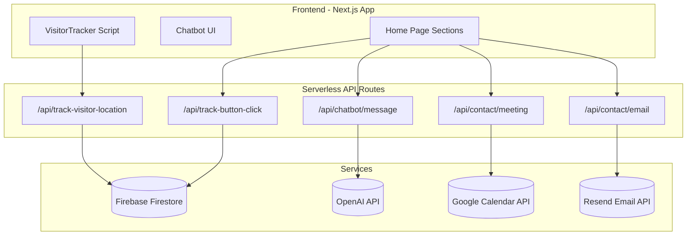

## 🧠 System Design

Click to view Mermaid diagram code

```mermaid
flowchart TD
  subgraph Frontend [Frontend - Next.js App]
    A[Home Page Sections]
    B[Chatbot UI]
    C[VisitorTracker Script]
  end

  subgraph API [Serverless API Routes]
    D1["/api/contact/email"]
    E1["/api/contact/meeting"]
    F1["/api/chatbot/message"]
    G1["/api/track-visitor-location"]
    H1["/api/track-button-click"]
  end

  subgraph Services
    I[(Firebase Firestore)]
    J[(OpenAI API)]
    K[(Google Calendar API)]
    L[(Resend Email API)]
  end

  A --> D1
  A --> E1
  A --> F1
  C --> G1
  A --> H1
  D1 --> L
  E1 --> K
  F1 --> J
  G1 --> I
  H1 --> I
```

